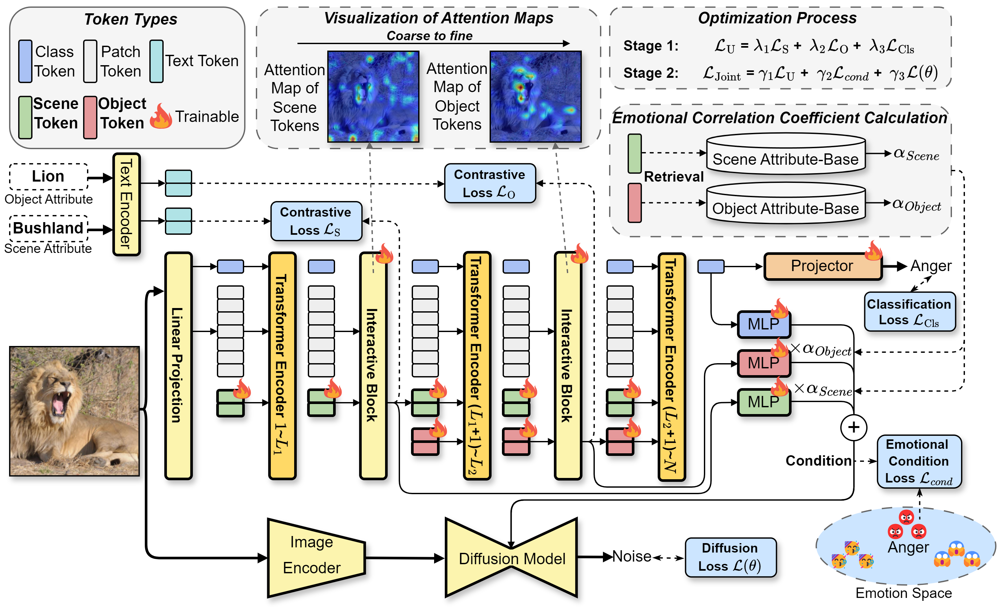

<div align="center">
<h2 class="papername"> UniEmo: Unifying Emotional Understanding and Generation with Learnable Expert Queries
Reasoning </h2>
<div>
    <a href="https://scholar.google.com.hk/citations?user=0GtAUPoAAAAJ&hl=zh-CN&oi=sra" target="_blank">Yijie Zhu</a>,
    <a href="https://zls030726.github.io/" target="_blank">Lingsen Zhang</a>,
    <a href="https://zitongyu.github.io/" target="_blank">Zitong Yu*</a>, 
    <a href="https://rshaojimmy.github.io/OrionLab/" target="_blank">Rui Shao*</a>,
    <a href="https://scholar.google.com/citations?user=lLg3WRkAAAAJ&hl=en" target="_blank">Kaiyang Zhou</a>,
    <a href="http://faculty.hitsz.edu.cn/guanweili" target="_blank">Liqiang Nie</a>
</div>

School of Computer Science and Technology, Harbin Institute of Technology, Shenzhen<br>
Great Bay University<br>
Macau Polytechnic University<br>
*Corresponding author<br>
[](https://github.com/JiuTian-VL/UniEmo)


</div>

</div>

## 🔥 If you find this work useful for your research, please kindly cite our paper and star our repo.

## 🔥 Introduction

This is the github repository of *UniEmo: Unifying Emotional Understanding and Generation with Learnable Expert Queries*. In this work, we introduce UniEmo, a unified framework that synergistically integrates emotional understanding and generation through a hierarchical understanding chain and dual generation‑driven feedback.
The whole framework of UniEmo:

<div align="center">

</div>

## 🔥 Details will be released. Stay tuned.

## 📝 Citation

```bib
@article{zhu2025uniemo,
  title={UniEmo: Unifying Emotional Understanding and Generation with Learnable Expert Queries},
  author={Zhu, Yijie and Zhang, Lingsen and Yu, Zitong and Shao, Rui and Tan, Taoo and Nie, Liqiang},
  journal={arXiv},
  year={2025}
}