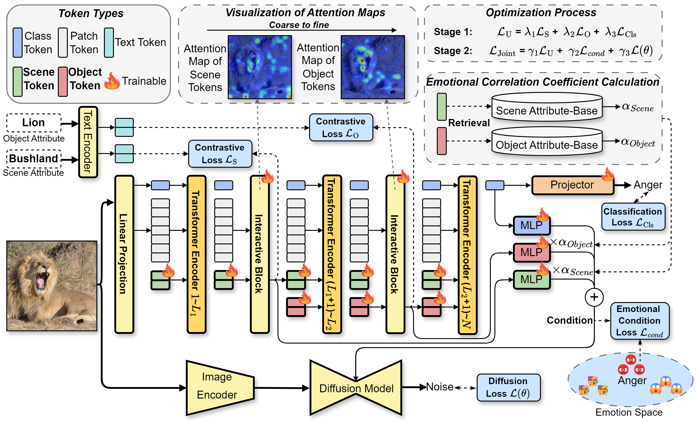
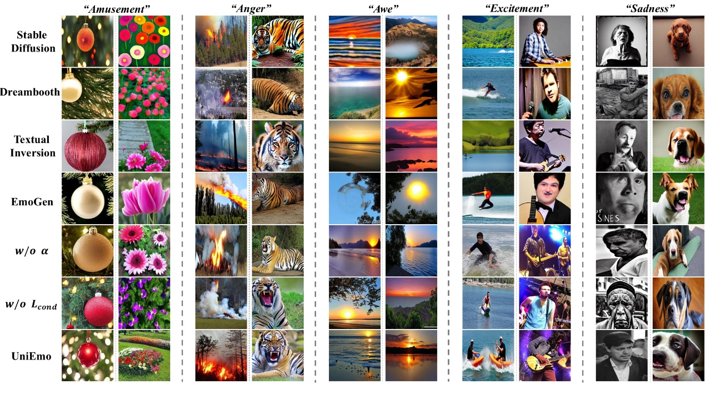
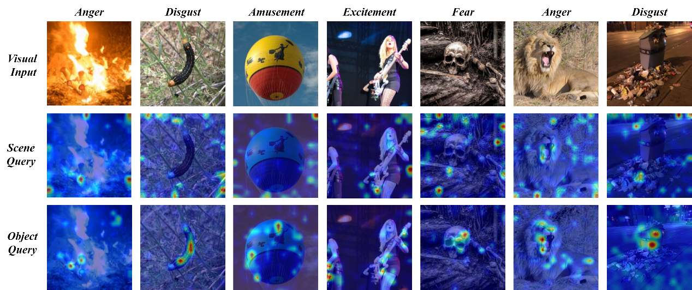

<div align="center">
<h2 class="papername"> UniEmo: Unifying Emotional Understanding and Generation with Learnable Expert Queries </h2>
<div>
    <a href="https://scholar.google.com.hk/citations?user=0GtAUPoAAAAJ&hl=zh-CN&oi=sra" target="_blank">Yijie Zhu</a>,
    <a href="https://zls030726.github.io/" target="_blank">Lingsen Zhang</a>,
    <a href="https://zitongyu.github.io/" target="_blank">Zitong Yu*</a>, 
    <a href="https://rshaojimmy.github.io/OrionLab/" target="_blank">Rui Shao*</a>,
    <a href="https://scholar.google.com/citations?user=lLg3WRkAAAAJ&hl=en" target="_blank">Tao Tan</a>,
    <a href="http://faculty.hitsz.edu.cn/guanweili" target="_blank">Liqiang Nie</a>
</div>

School of Computer Science and Technology, Harbin Institute of Technology, Shenzhen<br>
Great Bay University<br>
Macau Polytechnic University<br>
*Corresponding author<br>
[](https://arxiv.org/pdf/2507.23372)
[](https://dl.acm.org/doi/abs/10.1145/3746027.3754549)


</div>

</div>

## 🔥 If you find this work useful for your research, please kindly cite our paper and star our repo.
## :fire: Updates
- [04/2026] :fire: UniEmo has been accepted by **TIP**!
- [07/2025] :fire: [arXiv paper](https://arxiv.org/pdf/2507.23372) released!
## 🔥 Introduction

This is the official repository for **UniEmo: Unifying Emotional Understanding and Generation with Learnable Expert Queries**.

In this work, we introduce **UniEmo**, a unified framework that synergistically integrates visual emotional understanding and emotion-conditioned image generation. UniEmo builds a hierarchical emotional understanding chain with learnable expert queries to progressively capture scene-level and object-level emotional cues. These representations are further used to guide emotional image generation, while the generation branch provides dual feedback to enhance emotional understanding.

The overall framework of UniEmo is shown below:

<div align="center">

</div>

## 🔥 Visualization
### Emotional Image Generation Results

Emotion-evoking images generated by **UniEmo**:

<div align="center">

</div>

UniEmo can generate visually coherent and emotionally expressive images conditioned on different target emotions. The results show that the generated images not only preserve clear semantic content, but also exhibit emotion-specific visual cues such as color tone, scene atmosphere, object appearance, and contextual composition.

### Attention Visualization of Expert Queries

Visualization of attention maps from the two types of expert queries:

<div align="center">

</div>

The attention maps demonstrate that the proposed expert queries learn complementary emotional cues. Scene-level queries tend to focus on global contextual regions that shape the overall emotional atmosphere, while object-level queries attend to local emotion-related objects or details. This coarse-to-fine attention behavior supports UniEmo in extracting richer emotional representations for both understanding and generation.


## 🔥 Details will be released. Stay tuned.

## 📝 Citation

```bib
@misc{zhu2025uniemounifyingemotionalunderstanding,
      title={UniEmo: Unifying Emotional Understanding and Generation with Learnable Expert Queries}, 
      author={Yijie Zhu and Lingsen Zhang and Zitong Yu and Rui Shao and Tao Tan and Liqiang Nie},
      year={2025},
      eprint={2507.23372},
      archivePrefix={arXiv},
      primaryClass={cs.CV},
      url={https://arxiv.org/abs/2507.23372}, 
}

